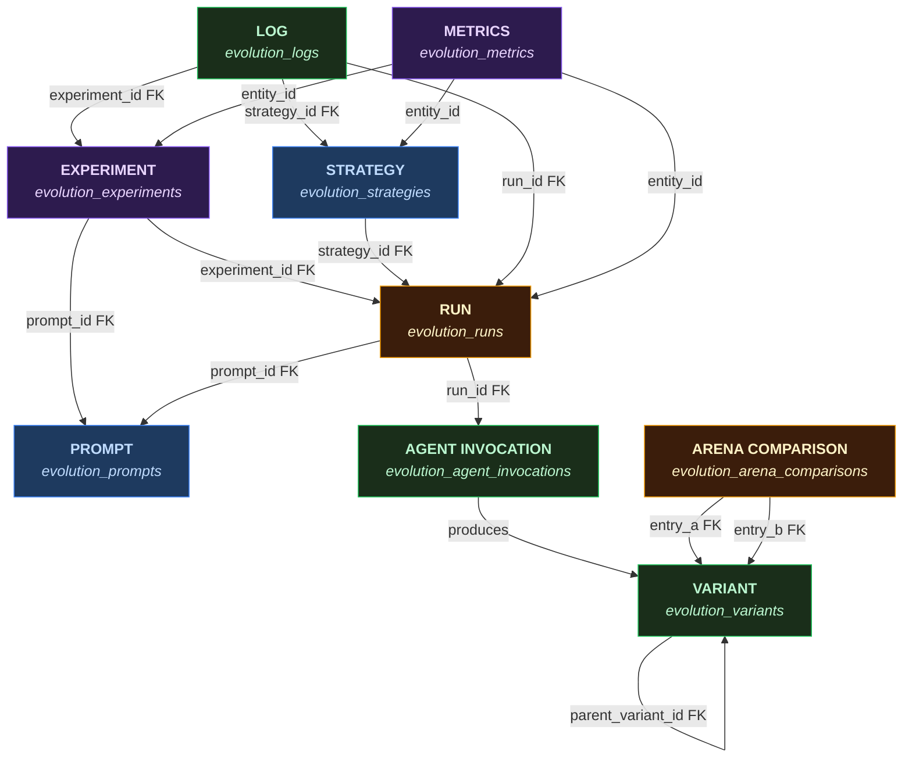

# Entity Relationships

Core entities and their relationships in the evolution pipeline data model. For the full table schemas, see [Data Model](./data_model.md).

## Entity Diagram

## Relationships

| From | To | FK | Cardinality | Notes |
|------|----|----|-------------|-------|
| Experiment | Prompt | `experiment.prompt_id` | 1:1 | Each experiment targets exactly one prompt |
| Experiment | Run | `run.experiment_id` | 1:N | Experiment creates N runs (manually configured) |
| Strategy | Run | `run.strategy_id` | 1:N | NOT NULL — every run must have a strategy. Reused via SHA-256 config hash dedup. Runner reads config from this FK at runtime (no inline `config` JSONB on run). `budget_cap_usd` is a direct column on the run row. |
| Run | Prompt | `run.prompt_id` | N:1 | Inherited from parent experiment |
| Run | Agent Invocation | `invocation.run_id` | 1:N | One per agent per iteration, UNIQUE(run_id, iteration, agent_name) |
| Agent Invocation | Variant | logical (agent_name + generation) | 1:N | Agents produce variants during execution |
| Variant | Variant | `variant.parent_variant_id` | 0:1 | Self-referential lineage (crossover has multiple parents in pipeline state) |
| Arena Comparison | Variant | `arena_comparison.entry_a` | N:1 | References a variant with `synced_to_arena=true` |
| Arena Comparison | Variant | `arena_comparison.entry_b` | N:1 | References a variant with `synced_to_arena=true` |
| Log | Run/Experiment/Strategy | denormalized FKs | N:1 | `entity_type` + `entity_id` identify direct emitter; ancestor FKs enable aggregation |
| Metrics | Run/Strategy/Experiment | `entity_type` + `entity_id` | N:1 | Polymorphic — entity_type determines which entity the metric belongs to |

## Entity Summary

| Entity | Table | UI Access |
|--------|-------|-----------|
| Experiment | `evolution_experiments` | `/admin/evolution/experiments/[id]` |
| Prompt | `evolution_prompts` | `/admin/evolution/prompts/[id]` |
| Strategy | `evolution_strategies` | `/admin/evolution/strategies/[id]` |
| Run | `evolution_runs` | `/admin/evolution/runs/[id]` |
| Agent Invocation | `evolution_agent_invocations` | `/admin/evolution/invocations/[id]` |
| Variant | `evolution_variants` | `/admin/evolution/variants/[id]` |
| Arena Comparison | `evolution_arena_comparisons` | Arena leaderboard pages |
| Log | `evolution_logs` | Logs tab on run/experiment/strategy/invocation detail pages |
| Metrics | `evolution_metrics` | Metrics tab on entity detail pages |

## FK Cascade Behaviors

- **CASCADE deletes** on run children (variants, invocations, logs) — deleting a run cleans up all associated data.
- **CASCADE deletes** on arena comparisons from variants — deleting a variant removes its comparison history.
- **CASCADE deletes** on arena comparisons and variants from prompts — deleting a prompt removes its entire arena.
- **SET NULL** on arena comparison `run_id` — deleting a run preserves comparison history but loses provenance.

## Agent Metric Merging

Agent subclasses can declare metrics that are specific to their execution context (e.g. rejection rates, comparison counts). These are merged into `InvocationEntity`'s metric list at startup rather than being hardcoded there, keeping agent and entity concerns separate.

### How it works

1. Each concrete `Agent` subclass optionally declares `invocationMetrics: FinalizationMetricDef[]` alongside its `detailViewConfig`.
2. `agentRegistry.ts` exports `getAgentClasses()`, which returns all concrete Agent subclasses without importing them in a way that creates circular dependencies.
3. `entityRegistry.ts` calls `getAgentClasses()` during lazy init and merges each agent's `invocationMetrics` into `InvocationEntity.metrics` before the entity is returned to callers.

### Current agent metrics

| Agent | Metric key | Description |
|-------|-----------|-------------|
| `GenerationAgent` | `format_rejection_rate` | Fraction of generated variants rejected by format validation |
| `RankingAgent` | `total_comparisons` | Total pairwise comparisons performed (triage + Swiss rounds) |

These metrics appear on the `InvocationEntity` detail page alongside the standard invocation metrics (cost, duration, success rate) defined in `metricCatalog.ts`.

## Cross-References

- [Data Model](./data_model.md) — full table schemas, column types, and constraints
- [Architecture](./architecture.md) — how entities are created and used during pipeline execution
- [Strategies & Experiments](./strategies_and_experiments.md) — strategy and experiment lifecycle
