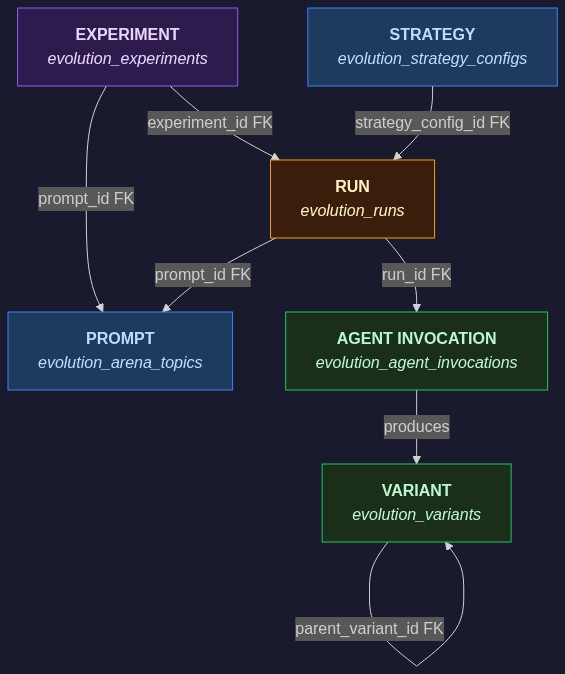
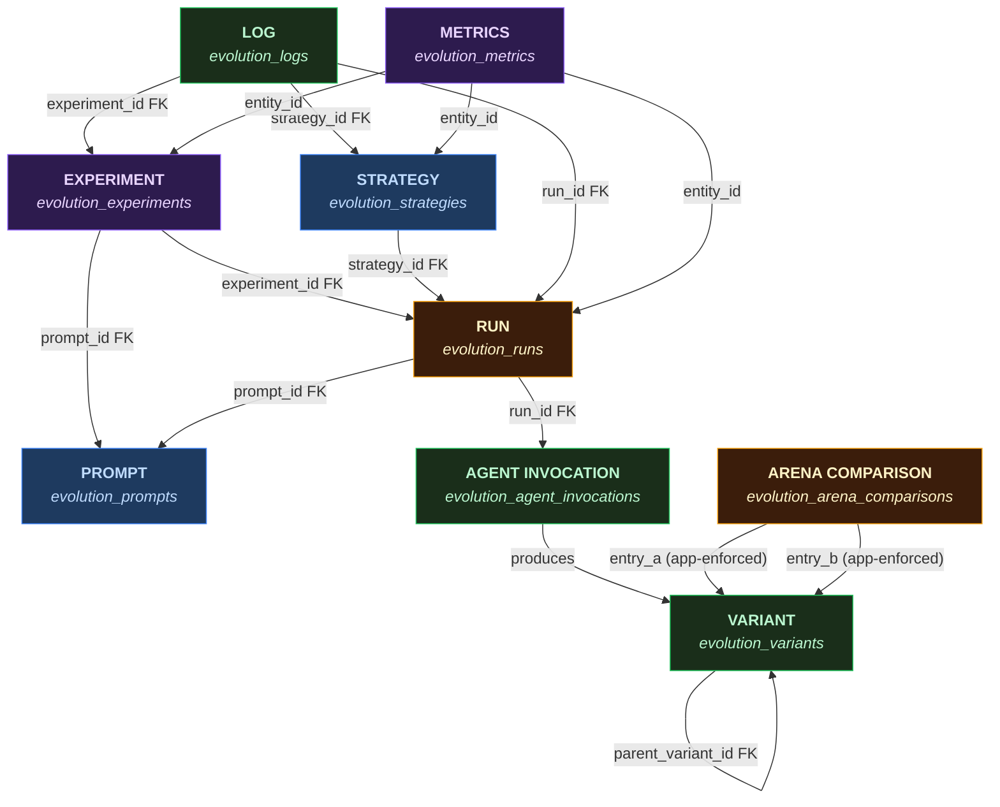

# Entity Relationships

Core entities and their relationships in the evolution pipeline data model. For the full table schemas, see [Data Model](./data_model.md).

## Entity Diagram





## Relationships

| From | To | FK | Cardinality | Notes |
|------|----|----|-------------|-------|
| Experiment | Prompt | `experiment.prompt_id` | 1:1 | Each experiment targets exactly one prompt |
| Experiment | Run | `run.experiment_id` | 1:N | Experiment creates N runs (manually configured) |
| Strategy | Run | `run.strategy_id` | 1:N | NOT NULL — every run must have a strategy. Reused via SHA-256 config hash dedup. Runner reads config from this FK at runtime (no inline `config` JSONB on run). `budget_cap_usd` is a direct column on the run row. |
| Run | Prompt | `run.prompt_id` | N:1 | Inherited from parent experiment |
| Run | Agent Invocation | `invocation.run_id` | 1:N | One per agent per iteration, UNIQUE(run_id, iteration, agent_name) |
| Agent Invocation | Variant | logical (agent_name + generation) | 1:N | Agents produce variants during execution |
| Variant | Variant | `variant.parent_variant_id` | 0:1 | Self-referential lineage (crossover has multiple parents in pipeline state) |
| Arena Comparison | Variant | `arena_comparison.entry_a` (app-enforced) | N:1 | DB FK dropped (migration 20260409000001); app-layer cleanup in VariantEntity.ts |
| Arena Comparison | Variant | `arena_comparison.entry_b` (app-enforced) | N:1 | DB FK dropped (migration 20260409000001); app-layer cleanup in VariantEntity.ts |
| Log | Run/Experiment/Strategy | denormalized FKs | N:1 | `entity_type` + `entity_id` identify direct emitter; ancestor FKs enable aggregation |
| Metrics | Run/Strategy/Experiment | `entity_type` + `entity_id` | N:1 | Polymorphic — entity_type determines which entity the metric belongs to |

## Entity Summary

| Entity | Table | UI Access |
|--------|-------|-----------|
| Experiment | `evolution_experiments` | `/admin/evolution/experiments/[id]` |
| Prompt | `evolution_prompts` | `/admin/evolution/prompts/[id]` |
| Strategy | `evolution_strategies` | `/admin/evolution/strategies/[id]` |
| Run | `evolution_runs` | `/admin/evolution/runs/[id]` |
| Agent Invocation | `evolution_agent_invocations` | `/admin/evolution/invocations/[id]` |
| Variant | `evolution_variants` | `/admin/evolution/variants/[id]` |
| Arena Comparison | `evolution_arena_comparisons` | Arena leaderboard pages |
| Log | `evolution_logs` | Logs tab on run/experiment/strategy/invocation detail pages |
| Metrics | `evolution_metrics` | Metrics tab on entity detail pages |

## Entity Action Matrix

All entity actions use a delete-only model. Archive/unarchive support was removed in favor of hard deletes with recursive cascade.

| Entity | Actions | Notes |
|--------|---------|-------|
| Experiment | `cancel`, `delete` | Cancel stops in-progress runs; delete cascades to child runs |
| Prompt | `rename`, `edit`, `delete` | Delete cascades to experiments and runs |
| Strategy | `delete` | Delete cascades to child runs |
| Run | `cancel`, `delete` | Cancel sets status to `cancelled`; delete cascades to variants, invocations |
| Variant | `delete` | Delete removes arena comparisons referencing this variant, then the variant itself |
| Invocation | _(none)_ | Read-only; cleaned up by parent run delete |

Actions are declared on each entity subclass in `evolution/src/lib/core/entities/` and executed via the `executeEntityAction` server action (see [Reference](./reference.md)).

## FK Cascade Behaviors

All parent-child relationships use `cascade: 'delete'`. Deleting a parent entity recursively deletes all descendants.

Cascade tree:

```
Prompt
├── Experiment (prompt_id) → cascade delete
│   └── Run (experiment_id) → cascade delete
│       ├── Variant (run_id) → cascade delete
│       │   └── Arena Comparison (entry_a/entry_b) → explicit delete in VariantEntity.ts (DB FK removed)
│       └── Invocation (run_id) → cascade delete
└── Run (prompt_id) → cascade delete
        └── (same as above)

Strategy
└── Run (strategy_id) → cascade delete
        └── (same as above)
```

The base `Entity.executeAction` method handles recursive child deletion automatically when the action key is `delete`. Custom pre-delete logic (e.g., Variant cleaning up arena comparisons) is implemented in entity-specific `executeAction` overrides.

## UI Conventions

### Entity Cross-Links

Detail pages use `EntityDetailHeader`'s `links` prop to cross-reference related entities. Each link is `{ prefix: string; label: string; href: string }` — for example, a run detail page links to its parent experiment and strategy. This provides one-click navigation between related entities.

### Breadcrumb Convention

All evolution pages use "Evolution" as the root breadcrumb, linking to `/admin/evolution-dashboard`. Subsequent breadcrumb segments reflect the entity type and name (e.g., "Evolution > Runs > Run abc123").

### CopyableId

Entity IDs displayed in detail headers are clickable — clicking copies the full UUID to the clipboard via the `CopyableId` component. This avoids the need to manually select and copy long UUIDs.

## Agent Metric Merging

Agent subclasses can declare metrics that are specific to their execution context (e.g. rejection rates, comparison counts). These are merged into `InvocationEntity`'s metric list at startup rather than being hardcoded there, keeping agent and entity concerns separate.

### How it works

1. Each concrete `Agent` subclass optionally declares `invocationMetrics: FinalizationMetricDef[]` alongside its `detailViewConfig`.
2. `agentRegistry.ts` exports `getAgentClasses()`, which returns all concrete Agent subclasses without importing them in a way that creates circular dependencies.
3. `entityRegistry.ts` calls `getAgentClasses()` during lazy init and merges each agent's `invocationMetrics` into `InvocationEntity.metrics` before the entity is returned to callers.

### Current agent metrics

| Agent | Metric key | Description |
|-------|-----------|-------------|
| `GenerationAgent` | `format_rejection_rate` | Fraction of generated variants rejected by format validation |
| `RankingAgent` | `total_comparisons` | Total pairwise comparisons performed (triage + Swiss rounds) |

These metrics appear on the `InvocationEntity` detail page alongside the standard invocation metrics (cost, duration, success rate) defined in `metricCatalog.ts`.

## Cross-References

- [Data Model](./data_model.md) — full table schemas, column types, and constraints
- [Architecture](./architecture.md) — how entities are created and used during pipeline execution
- [Strategies & Experiments](./strategies_and_experiments.md) — strategy and experiment lifecycle
