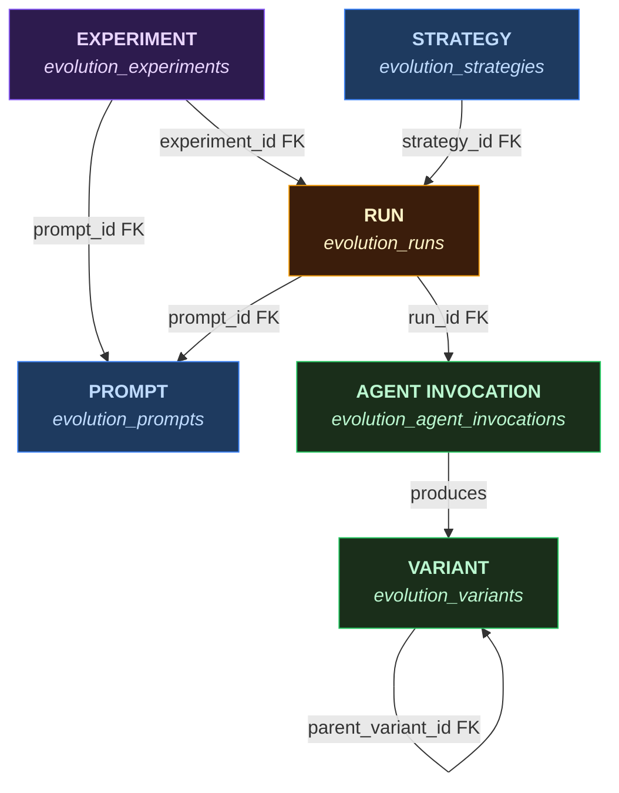

# Evolution Entity Relationship Diagram

Core entities and their relationships in the evolution pipeline data model.

## Relationships

| From | To | FK | Cardinality | Notes |
|------|----|----|-------------|-------|
| Experiment | Prompt | `experiment.prompt_id` | 1:1 | Each experiment targets exactly one prompt |
| Experiment | Run | `run.experiment_id` | 1:N | Experiment creates N runs (manually configured) |
| Strategy | Run | `run.strategy_id` | 1:N | NOT NULL — every run must have a strategy. Reused via SHA-256 config hash dedup. Runner reads config from this FK at runtime (no inline `config` JSONB on run). `budget_cap_usd` is a direct column on the run row. |
| Run | Prompt | `run.prompt_id` | N:1 | Inherited from parent experiment |
| Run | Agent Invocation | `invocation.run_id` | 1:N | One per agent per iteration, UNIQUE(run_id, iteration, agent_name) |
| Agent Invocation | Variant | logical (agent_name + generation) | 1:N | Agents produce variants during execution |
| Variant | Variant | `variant.parent_variant_id` | 0:1 | Self-referential lineage (crossover has multiple parents in pipeline state) |

## Entity Summary

| Entity | Table | UI Access |
|--------|-------|-----------|
| Experiment | `evolution_experiments` | `/admin/evolution/experiments/[id]` |
| Prompt | `evolution_prompts` | Listed in experiment creation |
| Strategy | `evolution_strategies` | Listed in experiment creation |
| Run | `evolution_runs` | Runs tab within experiment detail |
| Agent Invocation | `evolution_agent_invocations` | DB only (no UI page) |
| Variant | `evolution_variants` | DB only (no UI page) |
